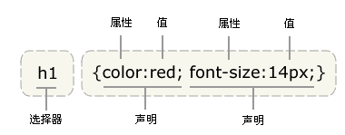
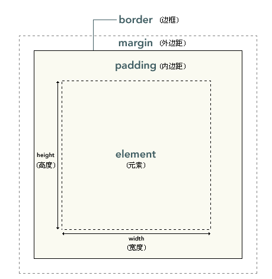
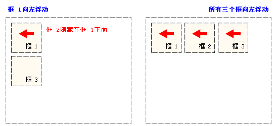

## css 语法结构
---------------------------



## css 盒模型
---------------------------


大小： width, height
边框： border
内边距:  padding
外边距:  margin

-   边框和内边距及外边距都会占用元素布局空间；因此计算时要考虑这些因素
-   外边距可以使用负值；但是其它属性不可以；
-   各属性都可以单独定义四边大小； 
-   单行定义（(上下-左右；顺时针方向 分别为top – right-bottom-left)）

> 上下外边距自动合并

## 定位: position
---------------------------

通过使用 `position` 属性，我们可以选择 4 种不同类型的定位，这会影响元素框生成的方式。

- static
元素框正常生成。块级元素生成一个矩形框，作为文档流的一部分，行内元素则会创建一个或多个行框，置于其父元素中。

- relative
元素框偏移某个距离。元素仍保持其未定位前的形状，它原本所占的空间仍保留。

- absolute

元素框从文档流完全删除，并相对于其包含块定位。包含块可能是文档中的另一个元素或者是初始包含块。元素原先在正常文档流中所占的空间会关闭，就好像元素原来不存在一样。元素定位后生成一个块级框，而不论原来它在正常流中生成何种类型的框。

- fixed
元素框的表现类似于将 position 设置为 absolute，不过其包含块是视窗本身。

## 浮动: float
-------------------------

> 浮动的框可以向左或向右移动，直到它的外边缘碰到包含框或另一个浮动框的边框为止。




> 浮动元素脱离原默认的布局空间；如果要占用一定空间，不遮住其它元素，需要用到`clear`属性

## 嵌入样式方法
-------------------------

###外部样式表

```html
    <head>
    <link rel="stylesheet" type="text/css" href="mystyle.css" />
    </head>
```

### 内部样式表

```html
    <head>
    <style type="text/css">
      hr {color: sienna;}
      p {margin-left: 20px;}
      body {background-image: url("images/back40.gif");}
    </style>
    </head>
```
### 内联样式

```html
<p style="color: sienna; margin-left: 20px"></p>
```


